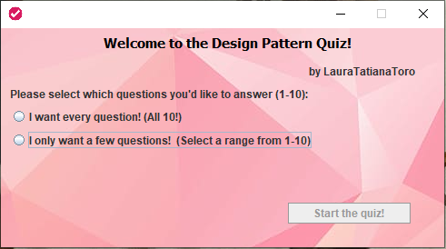
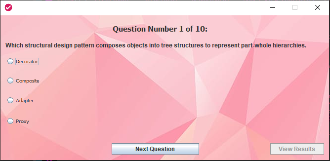
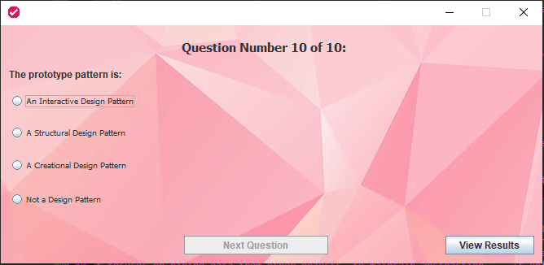
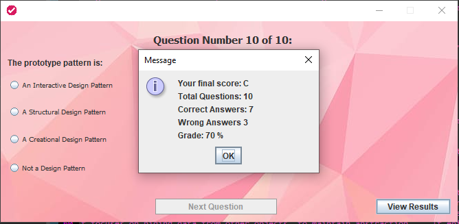

# DesignPatternQuiz

<b>TOOLS USED: Java 17, Eclipse IDE, Apache Maven, PLUGIN: Window Builder for Eclipse</b>

Test you knowledge of the Design Patterns as specified by the GoF!❓💡📚

  

A fun Quiz desktop application for testing you knowledge of [Design Patterns](https://en.wikipedia.org/wiki/Design_Patterns)

## Features:
* 10 real and original questions made by me based on actual information about Design Patterns
* Select the range of questions you'd like to answer
* Questions generated in random order everytime
* Answers generated in random order everytime, and in different order than the previous question
* Grade Calculated at the end of the quiz

## Screenshots

  

  

  

## Credits

* [Rauls Udemy Course for Making a Testing Center](https://www.udemy.com/share/103psa3@s1jOBHWg5EG0aR5VZI2t8crXHyZZWx2vKIAM6_LK0qXgZ54oZJD8D4lj9aAQ94WAYw==/)

